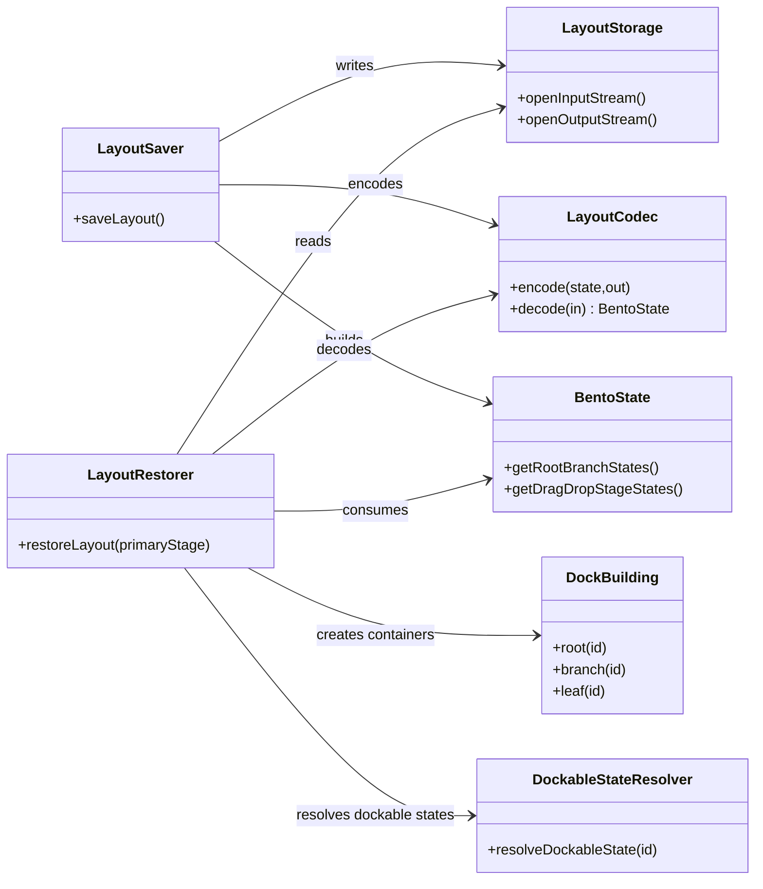
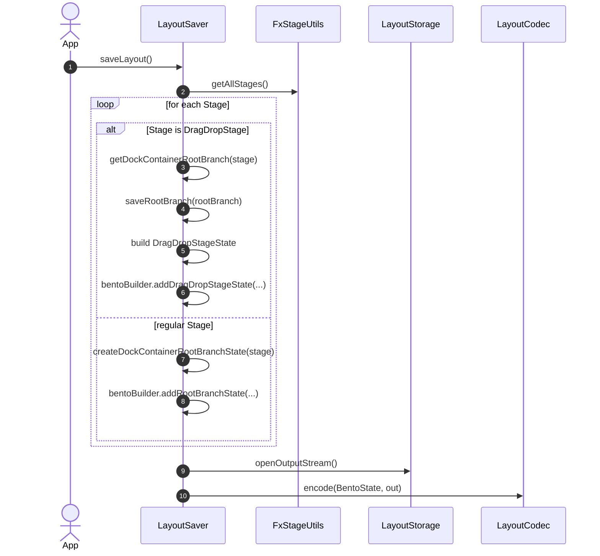
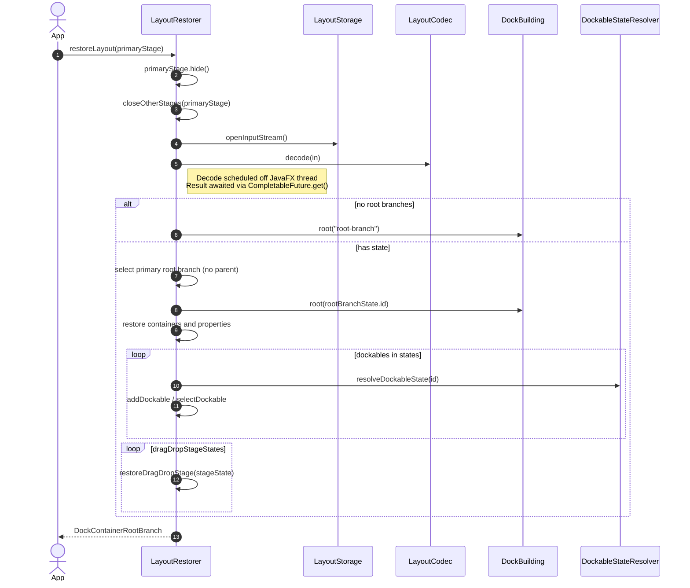
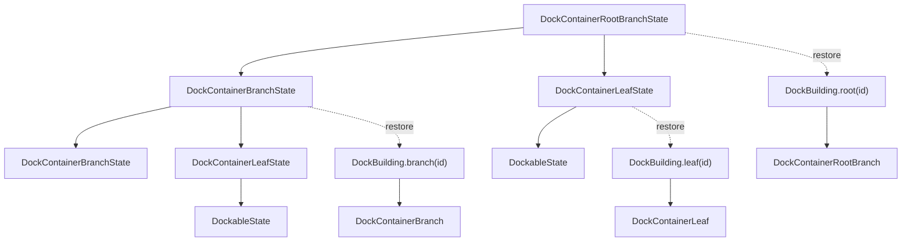

# Bento layout persistence diagrams

## Components overview

```mermaid
classDiagram
  direction LR

  class LayoutSaver {
    +saveLayout()
  }

  class LayoutRestorer {
    +restoreLayout(primaryStage)
  }

  class LayoutStorage {
    +openInputStream()
    +openOutputStream()
  }

  class LayoutCodec {
    +encode(state,out)
    +decode(in) BentoState
  }

  class BentoState {
    +getRootBranchStates()
    +getDragDropStageStates()
  }

  class DockBuilding {
    +root(id)
    +branch(id)
    +leaf(id)
  }

  class DockableStateResolver {
    +resolveDockableState(id)
  }

  LayoutSaver --> LayoutStorage : writes
  LayoutSaver --> LayoutCodec : encodes
  LayoutSaver --> BentoState : builds

  LayoutRestorer --> LayoutStorage : reads
  LayoutRestorer --> LayoutCodec : decodes
  LayoutRestorer --> DockBuilding : creates containers
  LayoutRestorer --> DockableStateResolver : resolves dockable states
  LayoutRestorer --> BentoState : consumes
```

## saveLayout sequence

```mermaid
sequenceDiagram
  autonumber
  actor App
  participant Saver as LayoutSaver
  participant Fx as FxStageUtils
  participant Storage as LayoutStorage
  participant Codec as LayoutCodec

  App->>Saver: saveLayout()
  Saver->>Fx: getAllStages()
  loop for each Stage
    alt Stage is DragDropStage
      Saver->>Saver: getDockContainerRootBranch(stage)
      Saver->>Saver: saveRootBranch(rootBranch)
      Saver->>Saver: build DragDropStageState
      Saver->>Saver: bentoBuilder.addDragDropStageState(...)
    else regular Stage
      Saver->>Saver: createDockContainerRootBranchState(stage)
      Saver->>Saver: bentoBuilder.addRootBranchState(...)
    end
  end
  Saver->>Storage: openOutputStream()
  Saver->>Codec: encode(BentoState, out)
```

## restoreLayout sequence

```mermaid
sequenceDiagram
  autonumber
  actor App
  participant Restorer as LayoutRestorer
  participant Storage as LayoutStorage
  participant Codec as LayoutCodec
  participant Dock as DockBuilding
  participant Resolver as DockableStateResolver

  App->>Restorer: restoreLayout(primaryStage)
  Restorer->>Restorer: primaryStage.hide()
  Restorer->>Restorer: closeOtherStages(primaryStage)

  Restorer->>Storage: openInputStream()
  Restorer->>Codec: decode(in)
  Note right of Restorer: Decode scheduled off JavaFX thread <br/> Result awaited via CompletableFuture.get()

  alt no root branches
    Restorer->>Dock: root("root-branch")
  else has state
    Restorer->>Restorer: select primary root branch (no parent)
    Restorer->>Dock: root(rootBranchState.id)
    Restorer->>Restorer: restore containers and properties
    loop dockables in states
      Restorer->>Resolver: resolveDockableState(id)
      Restorer->>Restorer: addDockable / selectDockable
    end
    loop dragDropStageStates
      Restorer->>Restorer: restoreDragDropStage(stageState)
    end
  end

  Restorer-->>App: DockContainerRootBranch
```

## State-to-runtime mapping

```mermaid
flowchart TD
  A[DockContainerRootBranchState] --> B[DockContainerBranchState]
  A --> C[DockContainerLeafState]
  B --> B1[DockContainerBranchState]
  B --> C1[DockContainerLeafState]
  C --> D[DockableState]
  C1 --> D1[DockableState]
  
  A2["DockBuilding.root(id)"] --> R1["DockContainerRootBranch"]
  B2["DockBuilding.branch(id)"] --> R2["DockContainerBranch"]
  C2["DockBuilding.leaf(id)"] --> R3["DockContainerLeaf"]
  
  A -.->|restore| A2
  B -.->|restore| B2
  C -.->|restore| C2
```
