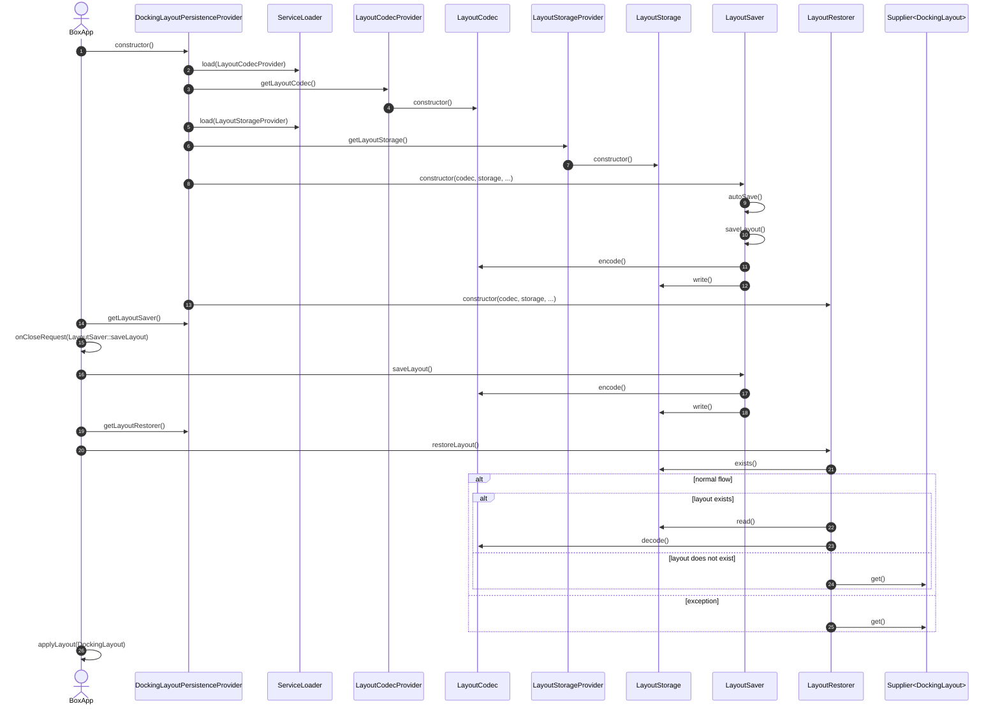
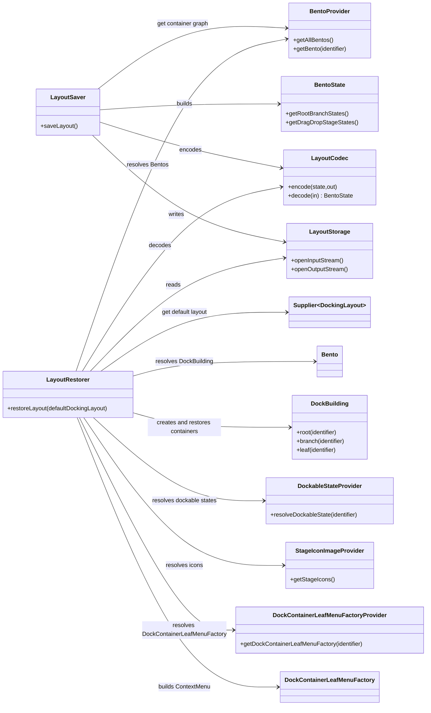

# Bento layout persistence diagrams

## Persistence Demo startup sequence

```mermaid
sequenceDiagram
    autonumber
    actor BoxApp
    participant persistenceProvider as DockingLayoutPersistenceProvider
    participant serviceLoader as ServiceLoader
    participant codecProvider as LayoutCodecProvider
    participant codec as LayoutCodec
    participant storageProvider as LayoutStorageProvider
    participant storage as LayoutStorage
    participant layoutSaver as LayoutSaver
    participant layoutRestorer as LayoutRestorer
    participant supplier as Supplier<DockingLayout>

    BoxApp->>persistenceProvider: constructor()
    persistenceProvider->>serviceLoader: load(LayoutCodecProvider)
    persistenceProvider->>codecProvider: getLayoutCodec()
    codecProvider->>codec:constructor()
    persistenceProvider->>serviceLoader: load(LayoutStorageProvider)
    persistenceProvider->>storageProvider: getLayoutStorage()
    storageProvider->>storage:constructor()
    persistenceProvider->>layoutSaver:constructor(codec, storage, ...)
    layoutSaver->>layoutSaver:autoSave()
    layoutSaver->>layoutSaver:saveLayout()
    layoutSaver->>codec:encode()
    layoutSaver->>storage:write()
    persistenceProvider->>layoutRestorer:constructor(codec, storage, ...)

    BoxApp->>persistenceProvider:getLayoutSaver()
    BoxApp->>BoxApp:onCloseRequest(LayoutSaver::saveLayout)
    BoxApp->>layoutSaver:saveLayout()
    layoutSaver->>codec:encode()
    layoutSaver->>storage:write()
    
    BoxApp->>persistenceProvider:getLayoutRestorer()
    BoxApp->>layoutRestorer:restoreLayout()
    layoutRestorer->>storage:exists()
    alt normal flow
        alt layout exists
            layoutRestorer->>storage:read()
            layoutRestorer->>codec:decode()
        else layout does not exist
            layoutRestorer->>supplier:get()
        end
    else exception
        layoutRestorer->>supplier:get()
    end
    BoxApp->>BoxApp:applyLayout(DockingLayout)
    
```

## Components overview

```mermaid
classDiagram
  direction LR

  class LayoutSaver {
    +saveLayout()
  }

  class LayoutRestorer {
    +restoreLayout(defaultDockingLayout)
  }
  
  class BentoProvider {
      +getAllBentos()
      +getBento(identifier)
  }

  class LayoutStorage {
    +openInputStream()
    +openOutputStream()
  }

  class LayoutCodec {
    +encode(state,out)
    +decode(in) BentoState
  }

  class BentoState {
    +getRootBranchStates()
    +getDragDropStageStates()
  }

  class DockBuilding {
    +root(identifier)
    +branch(identifier)
    +leaf(identifier)
  }

  class DockableStateProvider {
    +resolveDockableState(identifier)
  }
  
  class StageIconImageProvider {
      +getStageIcons()
  }
  
  class DockContainerLeafMenuFactoryProvider {
      +getDockContainerLeafMenuFactory(identifier)
  }

  LayoutSaver --> BentoProvider : get container graph
  LayoutSaver --> BentoState : builds
  LayoutSaver --> LayoutCodec : encodes
  LayoutSaver --> LayoutStorage : writes

  LayoutRestorer --> Supplier~DockingLayout~ : get default layout
  LayoutRestorer --> LayoutStorage : reads
  LayoutRestorer --> LayoutCodec : decodes
  LayoutRestorer --> BentoProvider : resolves Bentos
  LayoutRestorer --> Bento : resolves DockBuilding
  LayoutRestorer --> DockBuilding : creates and restores containers
  LayoutRestorer --> DockableStateProvider : resolves dockable states
  LayoutRestorer --> StageIconImageProvider: resolves icons
  LayoutRestorer --> DockContainerLeafMenuFactoryProvider: resolves DockContainerLeafMenuFactory
  LayoutRestorer --> DockContainerLeafMenuFactory: builds ContextMenu
```
