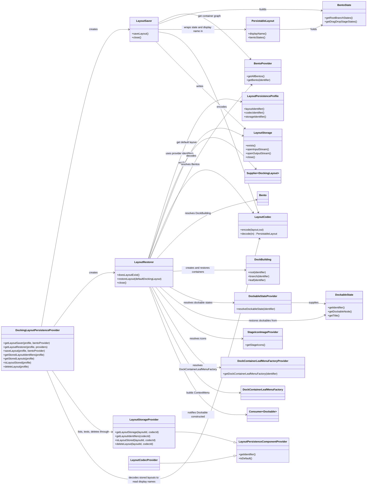
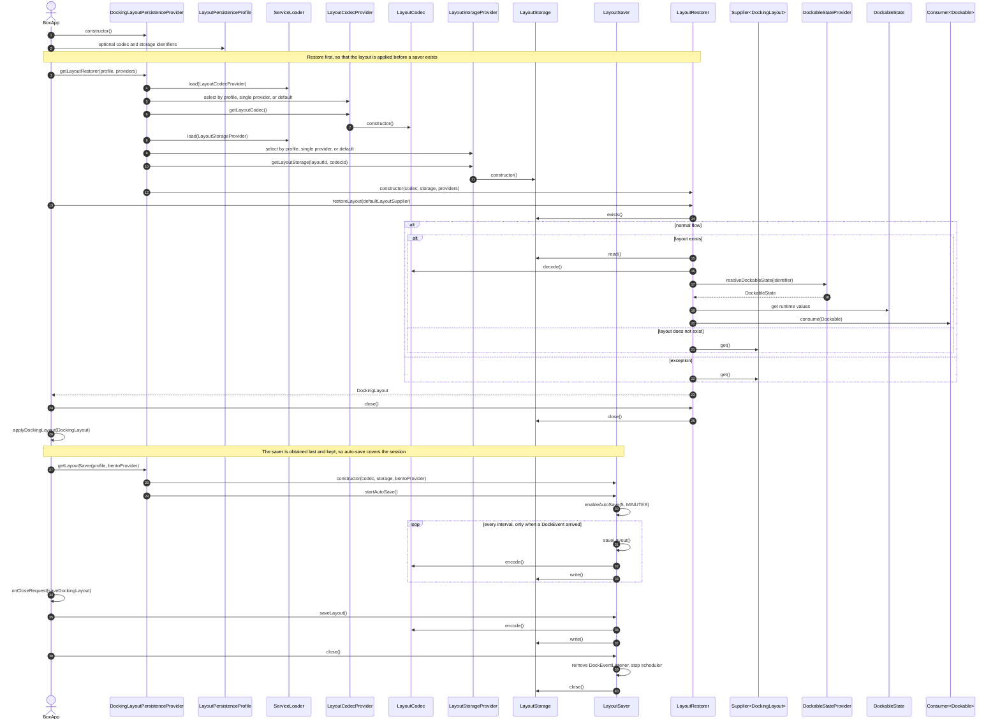
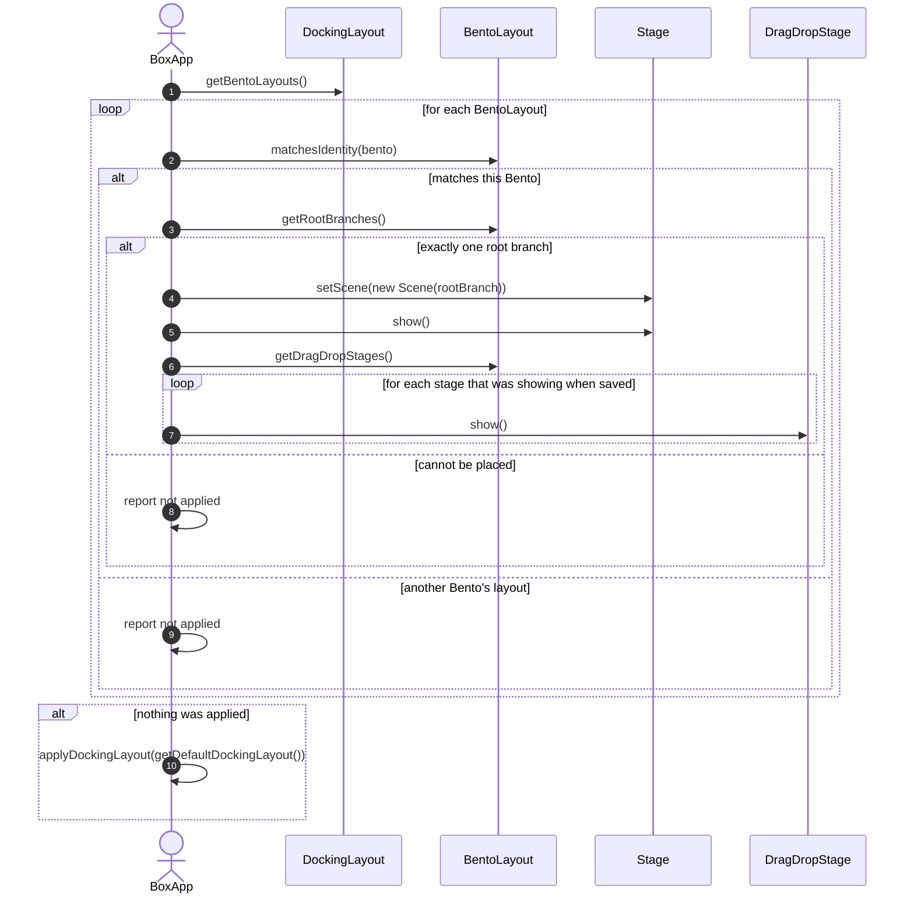

# Bento layout persistence diagrams

For implementation details and application integration guidance, see [Docking Layout Persistence Implementation](docking-layout-persistence.md). For a high-level overview, see the [BentoFX Persistence guide](../../README-PERSISTENCE.md).

## Components overview

## Persistence startup sequence

## Persistence Demo: Applying a DockingLayout

A `DockingLayout` holds one `BentoLayout` per persisted `Bento`, and the application decides what to do with each. Applying
can fail: a stored layout may name a `Bento` this application does not have, or hold a number of root branches it does not
know how to place. The application reports whether anything was applied and falls back to the default layout when nothing
was, because a `Stage` that never receives a `Scene` is never shown.

