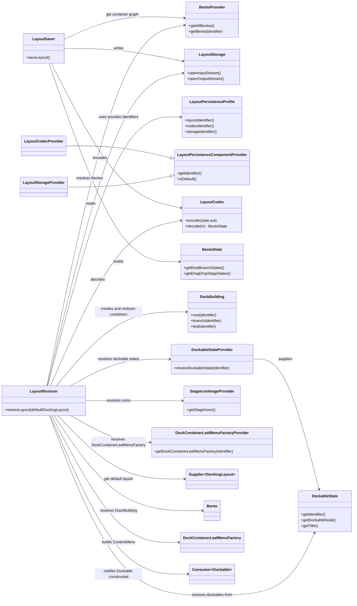
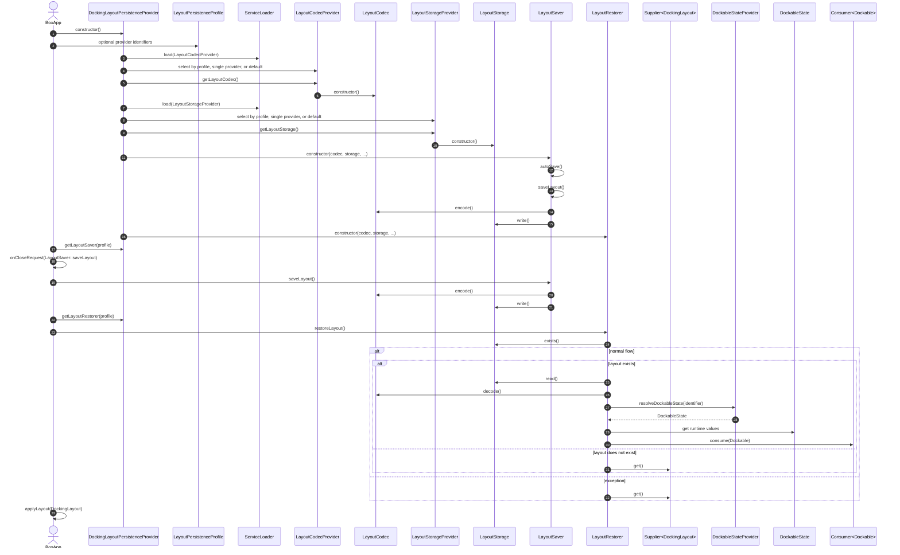
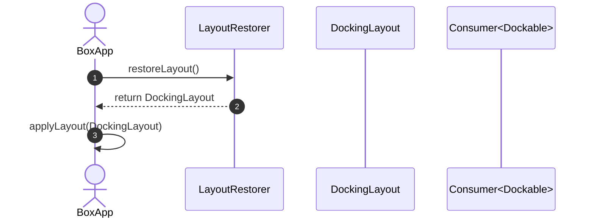

# Bento layout persistence diagrams

For implementation details and application integration guidance, see [Docking Layout Persistence Implementation](docking-layout-persistence.md). For a high-level overview, see the [README Persistence Framework](../../README.md#persistence).

## Components overview

## Persistence startup sequence

## Persistence Demo: Applying a DockingLayout

