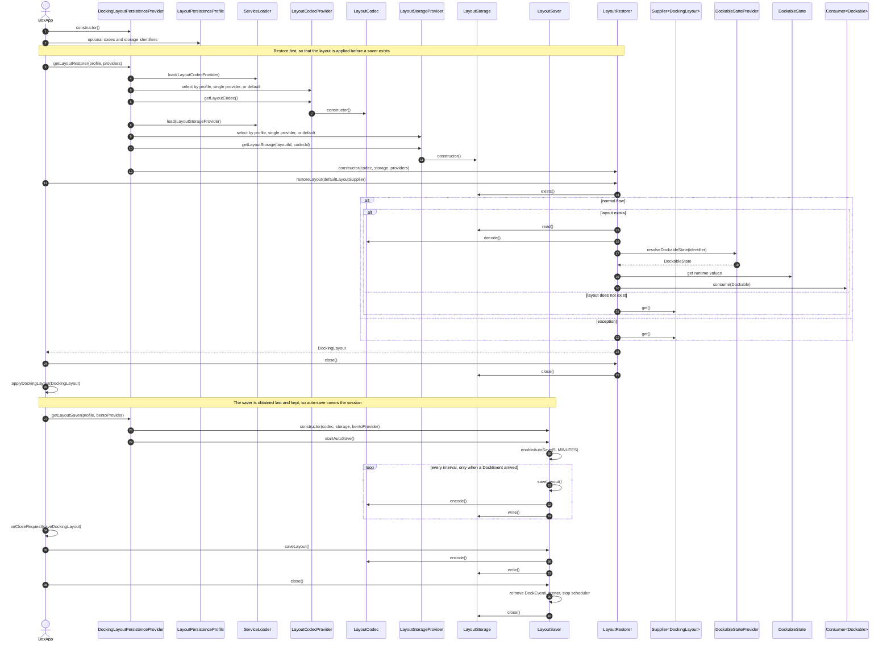
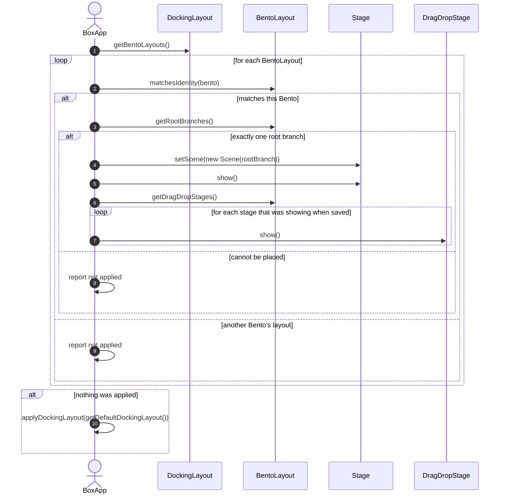

# Docking Layout Persistence Implementation

This document describes BentoFX layout persistence as implemented by
[DockingLayoutSaver](../../persistence/core/src/main/java/software/coley/bentofx/persistence/core/impl/DockingLayoutSaver.java)
and [DockingLayoutRestorer](../../persistence/core/src/main/java/software/coley/bentofx/persistence/core/impl/DockingLayoutRestorer.java).

For a high-level architectural overview, see the [BentoFX Persistence guide](guide.md).

## Scope

This document focuses on persistence orchestration and application integration. It does not describe rendering, docking
UX, or the full Gradle module dependency graph.

## Key concepts

### Domain state model

Persistence is expressed as immutable-ish *state* objects rather than direct serialization of user interface classes:

- `DockingLayout` is the application-facing restored layout. It contains one or more `BentoLayout` instances.
- `BentoLayout` contains runtime `DockContainerRootBranch` and `DragDropStage` instances for a single `Bento`.
- `BentoState` is the serializable state for a persisted `Bento`.
- `PersistableLayout` is what a codec encodes and decodes: the `BentoState` list plus the layout-level metadata, which includes an optional display name and group. See [Managing Layouts](layouts.md) for how those are used.
- `DockContainerRootBranchState`, `DockContainerBranchState`, and `DockContainerLeafState` represent the container tree.
- `DockableState` represents the information needed to reconstruct a runtime `Dockable`.
- `DragDropStageState` represents secondary drag/drop stages and contains a root-branch state.

An important distinction is that persisted state is not the same thing as live JavaFX nodes. The codec serializes state. The restorer uses that state, plus application-provided providers, to recreate runtime BentoFX objects.

### Storage and codec

Round-trip persistence is a multistep, pipelined process:

1. The application includes one or more `LayoutCodecProvider` implementations to make persisted formats available.
2. The application includes one or more `LayoutStorageProvider` implementations to make storage destinations available.
3. The default persistence provider selects codec and storage providers by explicit `LayoutPersistenceProfile` identifiers, by a single available provider, or by a single default provider.
4. `LayoutSaver` walks the current BentoFX container graph through a `BentoProvider`.
5. `LayoutSaver` builds serializable state, encodes it with `LayoutCodec`, and writes it with `LayoutStorage`.
6. `LayoutRestorer` reads state with `LayoutStorage`, decodes it with `LayoutCodec`, and rebuilds runtime layout objects.
7. The application applies the returned `DockingLayout` to its stages.

This decoupling lets applications choose the persisted format, such as XML or JSON, and the storage location, such as a file or database, without changing the save/restore process flow. In the simple case, changing providers requires only
a dependency change. When multiple providers are present, applications can select a specific codec or storage provider by identifier with `LayoutPersistenceProfile`.

## Internal process flow 

`DockingLayoutSaver` and `DockingLayoutRestorer` are intentionally thin. The JavaFX threading boundaries remain in these public entry points, while the detailed work is delegated to smaller package-private collaborators:

| Collaborator | Responsibility | Threading expectation |
|--------------|----------------|-----------------------|
| `BentoLayoutStateCaptor` | Walks live BentoFX objects and builds serializable `BentoState` instances. | JavaFX application thread. |
| `LayoutStateWriter` | Encodes captured state with `LayoutCodec` and writes it with `LayoutStorage`. | Off the JavaFX application thread. |
| `LayoutStateReader` | Reads persisted layouts with `LayoutStorage` and decodes them with `LayoutCodec`. | Off the JavaFX application thread. |
| `DockingLayoutStateRestorer` | Rebuilds live BentoFX objects from decoded state and application providers. | JavaFX application thread. |

This split keeps the public saver/restorer API stable while making the persistence pipeline easier to test. Unit tests can cover storage/codec error handling through `LayoutStateReader` and `LayoutStateWriter` without creating JavaFX stages,
and graphical integration tests can continue to cover full end-to-end save and restore behavior.

## Persistence startup sequence

The sequence below shows the full startup lifecycle: first restore so the layout is applied before a saver exists, then obtain the saver so auto-save persists layout changes over the life of the application session.

## Saving the layout design

`LayoutSaver.saveLayout()` persists the current state of every `Bento` the `BentoProvider` returns. The default implementation, [DockingLayoutSaver](../../persistence/core/src/main/java/software/coley/bentofx/persistence/core/impl/DockingLayoutSaver.java), extends [AbstractAutoCloseableLayoutSaver](../../persistence/core/src/main/java/software/coley/bentofx/persistence/core/impl/AbstractAutoCloseableLayoutSaver.java).

### Automatic scheduled saving

A saver obtained from a `DockingLayoutPersistenceProvider` is initialized with auto-saving enabled at the default five-minute interval. The auto-save process is change-aware, meaning the saver listens for `DockEvent` on every `Bento`, records when a `DockEvent` occurs, and on the expiration of each interval writes the current layout if a `DockEvent` has occurred since the last save. This process ensures unchanged layouts are not rewritten.

`AbstractAutoCloseableLayoutSaver` deliberately does not start auto-save from its constructor. Doing so publishes a partly-built object to a scheduler thread and to every `Bento` event bus before subclass fields are assigned, so a save firing in that window could observe a half-built saver. Instead, the provider calls `startAutoSave(...)` once construction is complete. A directly instantiated saver can be initialized with `enableAutoSave(long, TimeUnit)`.

The application-facing lifecycle - obtaining the saver after the layout is applied, saving on close, and closing the saver - is covered under [Saving the Layout](guide.md#saving-the-layout).

### How the container tree is captured

The saver uses `BentoProvider` to walk each `Bento` container graph and converts runtime objects to state objects:

- `Bento` -> `BentoState`
- `DragDropStage` -> `DragDropStageState`
- `DockContainerRootBranch` -> `DockContainerRootBranchState`
- `DockContainerBranch` -> `DockContainerBranchState`
- `DockContainerLeaf` -> `DockContainerLeafState`
- `Dockable` -> `DockableState`

### Error handling philosophy

- Saver attempts to build each state independently; failure to build one state should not prevent building others.
- Encoding and streaming failures are treated as fatal and reported through `BentoStateException`.

## Restoring the layout design

### High-level algorithm

`LayoutRestorer.restoreLayout(Supplier<DockingLayout> defaultLayoutSupplier)` returns an application-facing `DockingLayout`.

The default implementation:

1. Checks whether persisted layout storage exists.
2. If persisted layout storage does not exist, returns the layout from `defaultLayoutSupplier`.
3. If persisted layout storage exists, reads and decodes `BentoState`.
4. For each `BentoState`:
   - resolves the matching runtime `Bento` through `BentoProvider`
   - uses the `Bento`'s `DockBuilding` to recreate root branches, branches, leaves, and dockables
   - uses `DockableStateProvider` to resolve dockables by identifier
   - uses `DockContainerLeafMenuFactoryProvider` to restore leaf menu factories when available
   - creates a `BentoLayout` containing restored root branches and drag/drop stages
5. For each `DragDropStageState`:
   - restores the drag/drop stage root branch
   - uses `StageIconImageProvider` to restore stage icons when available
   - applies persisted stage geometry and other stage properties
6. Returns a `DockingLayout` containing the restored `BentoLayout` instances.

The application is responsible for applying the returned `DockingLayout`. In the persistence demo, `BoxApp` selects the `BentoLayout` whose identifier matches its `Bento`, creates a scene including the restored root branch, and shows any restored
drag/drop stages.

### How dockables are restored

Restoration resolves dockables by identifier:

1. Each persisted dockable state supplies an identifier.
2. `DockableStateProvider.resolveDockableState(identifier)` returns the application-owned `DockableState`.
3. The restorer creates a runtime `Dockable` using the current `Bento`'s `DockBuilding`.
4. Optional `DockableState` values are applied to the runtime `Dockable`.
5. The dockable is added to the restored leaf.
6. Selected dockable identifiers are applied after dockables have been added.

This means applications should keep dockable identifiers stable across versions. If an application intentionally removes or renames a dockable, the restorer can continue restoring the rest of the layout, but the missing dockable will be
skipped.

### Default layout fallback

The default layout supplier is more than a convenience. It is the first-run layout and the recovery layout.

It is used when:

- no persisted layout exists
- persisted layout storage cannot be read
- persisted layout state cannot be decoded

There is a fourth case the framework cannot detect - a layout that restores cleanly but that the application cannot apply, such as one holding a different number of root branches than the application knows how to place. An application should report whether it applied anything and fall back to the default layout when it did not.
Otherwise a stage never receives a `Scene` and is never shown, and an application whose exit path runs when its window hides can never be closed either.

The default layout should be built with the same identifiers and provider-backed dockable construction strategy used for restoration. That keeps first-run behavior and restored behavior consistent.

### Error handling philosophy

- If persisted layout cannot be found, the default layout supplier is used.
- If persisted layout cannot be decoded, the default layout supplier is used.
- If one dockable cannot be resolved, the restorer logs a warning and continues restoring the rest of the layout.
- Layout restoration attempts to restore components independently where possible.

### Applying a restored layout

A `DockingLayout` holds one `BentoLayout` per persisted `Bento`, and the application decides what to do with each. Applying a restored layout fail. A stored layout may name a `Bento` the application does not have, or hold a number of root branches it does not know how to place. The application reports whether anything was applied and falls back to the default layout when nothing was applied because a `Stage` that never receives a `Scene` is never shown.

## Basic demo vs persistence demo

| Concern | Basic demo | Persistence demo |
|---------|------------|------------------|
| Bento identity | Uses a default `Bento`. | Uses a `Bento` with a stable identifier. |
| Layout creation | Builds the runtime container tree directly in `start(Stage)`. | Builds a default `DockingLayout`, then restores or applies a `DockingLayout`. |
| Dockable creation | Creates dockables inline. | Resolves `DockableState` by stable identifier through `DockableStateProvider`. |
| Source of truth for dockables | Startup code. | Provider implementations. |
| Dockable placement | Placement is hard-coded during startup. | Default placement is hard-coded, but restored placement comes from persisted layout state. |
| Menus | Menu factories are set directly. | Menu factories are supplied by providers so restored objects receive the same behavior. |
| Stage handling | Creates and shows the primary scene directly. | Applies the restored `BentoLayout` to the stage and shows restored drag/drop stages, falling back to the default layout when none can be applied. |
| Shutdown behavior | Exits on hidden. | Saves the docking layout on close request, then closes the saver, both before stages are closed. Also offers `File > Exit`, which saves explicitly because closing a stage in code raises no close request. |
| Application menus | None. The scene root is the docking root branch. | A `MenuBar` above the docking area, so the scene root is a `VBox`. The basic demo has no menu bar because it has no application-level commands to offer. |
| Named layouts | None. | `Window > Layouts` saves the layout showing under a name, and restores, renames or deletes a stored one. Switching happens live, so the demo also owns taking auto-save down around the switch, and writing the outgoing arrangement to the session layout on the way out. |

## See also

- [BentoFX Persistence guide](guide.md) - the application-facing guide.
